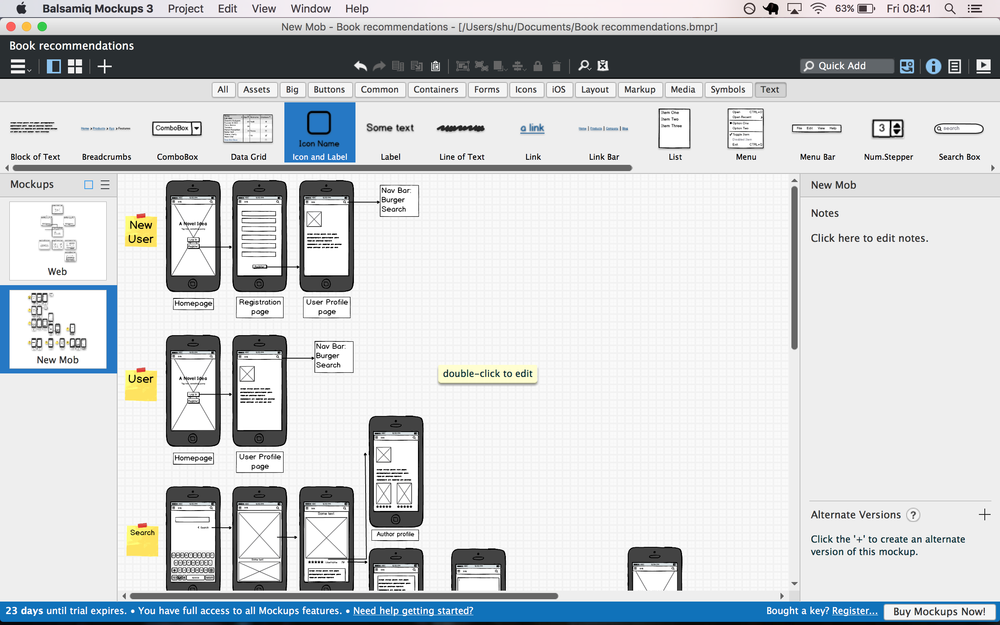
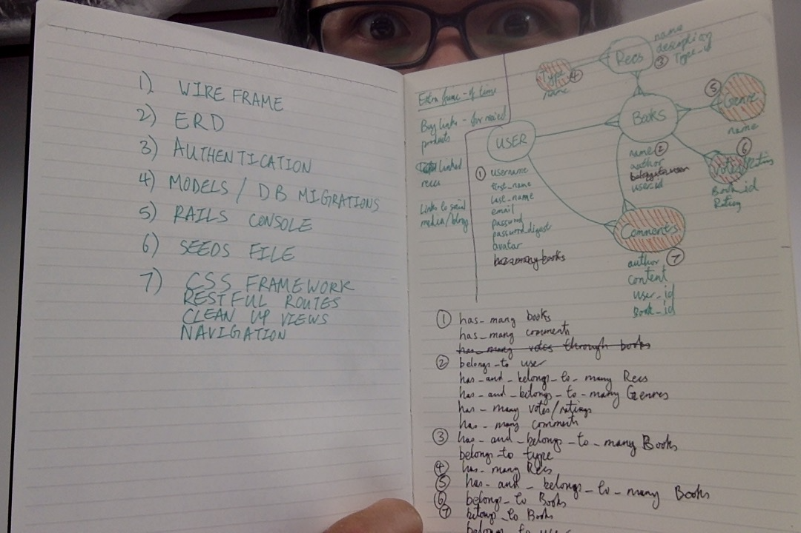

# WDI_21_Project_2
WDI Project 2: Project Harder

##Planning phase

This was an area which I know that I struggle in, as I have a tendency to charge headlong into the code, and this really showed in my previous project. This time around, I took care to (translation: Mike made me) finish the wireframing and the ERD (entity relationship diagrams) before I started to do any coding whatsoever. It took me a couple of attempts at the wireframe before I got it right - I unfortunately cannot show you the progress between before and after, as I deleted my previous wireframe out of anger/sadness/shame/existential dread. But below is an artists' interpretation of the mess as opposed to what it turned out to be:

Before:

After:

The ERD proved to be a little simpler, but that's mainly because I used a very expensive and technologically advanced drawing system, as shown below:

Superfunawesome tech:

How did that handsome guy get in the shot? Anyway, the last part of the plan is one of the most important (some would say the most important) - the choosing of a name for the website. I have one very simple criteria. There had to be a pun in there somewhere. I went through a few ideas:

- All Booked Up (sounds more like a hotel website - although I will reserve it now for the add-on book club site)
- I Like Big Books and I Cannot Lie (this felt a little too long, plus it discriminates against smaller books. Equality and all that jazz)
- Book, Line and Sinker (This one was a strong contender, but it lacked a certain gravitas that I wanted my joke pun title to have)
- When I Think about Books I Touch My Shelf (excellent pun, but only tainted by the fact that every time I read that sentence, I was doing a knock off Sean Connery accent in my head)

Eventually I went with "A Novel Idea". It's simple, elegant and effective - plus it fits my punny criteria.

## Back End

Before this started, I was dreaming about my week with Ruby, about how we would frolic in the metaphorical forest of code. About how we would joke and laugh and run barefoot through the bubbling springs of sublime. About how we would gaze lovingly into each other's eyes in the garden of rails.

This is the typical cautionary tale between expectaion vs reality. In reality, I found that Ruby was not my idealised and idolised aphrodite of code, but instead I learnt, to my horror and eternal regret that...

###Ruby is the devil's child.

The back-end phase started out badly - I fell ill (I assume it was a portent of things to come), so could only do some work on the Saturday and Sunday. And when I started with the code, I had to wrestle with ruby (not as fun as it sounds), eventually leading to me, in a frenzied and fragile haze, deleting everything and started again Sunday afternoon. Although, things could only get better...right?

I came up against a few difficulties with Ruby/Rails, exacerbated by the fact that Rails does a lot of stuff in the background the I don't understand, which makes debugging the code somewhat difficult.

One of the main issues that I has was in getting the recommendations to remember the book id when it is created so that it is automatically added to the book show page. I used a cookie/sessions method, but I found out afterwards that you needed to do nested routes instead, so I will be looking into that afterwards.

I also had to amend my ERD somewhat, as I originally didn't think that I needed the relationship between Recommendations and Users. That was a mistake and was added in without too many issues.

I also learnt the important lesson of destroying all seeded data before reseeding - I came up against an error in my Heroku upload and seed because the old data was not destroyed. I didn't realise the seed file needed to have this coded in, as in the development side we dropped the database in Terminal, so this was not required. This will be one of the first things I do next time with a seed file.

##Front End

The front-end monsters of CSS and HTML made me miss the (admittedly tumultous) days of Ruby.

One of the main issues that I had with styling is that I couldn't figure out how to link different stylesheets in Rails. But I strongly suspect that is because I didn't know the right way around this instead of there not being a way. I look forward to being schooled by everyone else's projects.

I know that styling is my weakest side, and I feel like I need a lot more hands on practise with it to get better (much like Ruby/Rails). So I used a lot of help from bootstrap. This had the unfortunate effect of making my website look like the illegitimate love child of Facebook and Bootstrap. I could take solace in the fact that it turned out looking vaguely competent.

I eventually didn't have enough time to make my website fully responsive, so the known issues are that the text does not scale with screen size - so on my mobile screen the text is tiny unless you zoom in. I will block out more time for styling in my next project. The lac of time was mainly down to unforseen bugs (although which bugs are forseen...) and the issues I had with the styling in general.

I also tried to add in another Gem at 8:30 the night before. This is akin to the parable of Icarus. Unlike Icarus, I turned back towards the sea before the burning glare of the Gem melted the wax of my poorly constructed code wings. I also decided against the adding of an additional model to my project (I wanted to add in events - for a book club/recommendations/books relationship). This is good for me, as my second main issue with my last project was that I tried to do too many things. This time, I managed to cut back.

##Lessons for the next project

- Make sure to think through relationships fully - I had missed one out.
- Try to code everything instead of scaffolding - I think I would gain a better understanding of the process.
- Try to use BCrypt instead of devise. Again, I think a more hands on approach would help with my understanding.
- Attempt parallax earlier - I had something working, but it was not fully functioning.
- Learn and understand the code that I am using more. I feel like my issues with Ruby are less to do with its competence and more to do with my own failings.
- Structured CSS.
- Make my styling look less bootstrappy. And even go as far as using as little bootstrap as possible.
